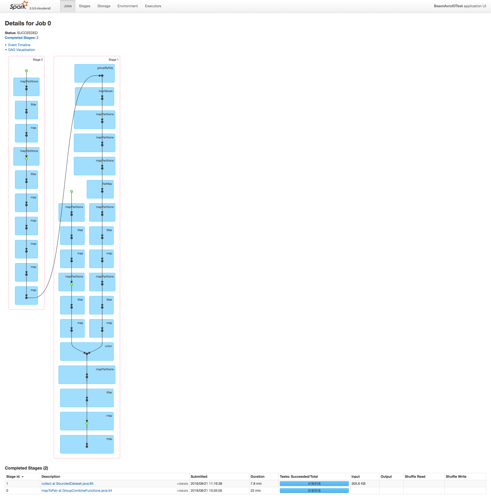

### Avro to Avro tests

Demonstration code for a simple read Avro, convert and write Avro test.

Code exists for testing with
1. Vanilla spark
2. Beam AvroIO for read and write (Beam on Spark/YARN)
3. Beam HadoopInputFormatIO for read and AvroIO for write (Beam on Spark/YARN)

Test environment is an idle 10 node Cloudera 5.12 cluster running Dell/Cloudera reference architecture (Dell 730xd, 48 core, 512GB, 14x4TB per node and 10GbE). 

Results show vanilla Spark around 18 minutes for a 1.5TB Avro file, with Beam up around 2 hours.

Early inspection indicates the bottelneck in the `WriteFiles` class of Beam which is fairly complex (2 jobs, temporary file writing, shuffles, group by key and union).

The Beam version produces 2 jobs with DAGs of:

##### Job 1

##### Job 2

  

  